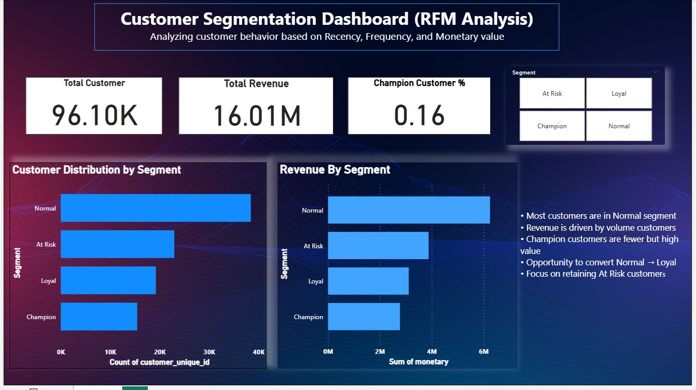

# E-Commerce Customer Segmentation using RFM Analysis

## Overview
This project analyzes customer purchasing behavior using RFM (Recency, Frequency, Monetary) analysis.

The goal is to segment customers and generate business insights for better decision-making.

## Tools Used
- Python
- Pandas
- Matplotlib
- SQLite
- Power BI

## Project Workflow
- Data Cleaning
- Exploratory Data Analysis
- SQL-based Data Transformation
- RFM Analysis
- Customer Segmentation
- Power BI Dashboard

## Dashboard

## Key Insights
- Most customers are in the Normal segment.
- A large number of customers are At Risk.
- Champion customers are fewer but high value.
- Revenue is mainly driven by volume customers.

## Business Impact
- Helps identify high-value customers.
- Supports targeted marketing strategies.
- Improves customer retention planning.

## How to Run
1. Open the notebook in VS Code or Jupyter Notebook.
2. Run all cells step by step.
3. The final CSV will be created in the dashboard folder.
4. Open the Power BI file to view the dashboard.